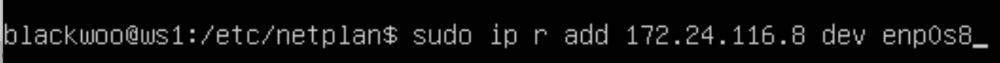
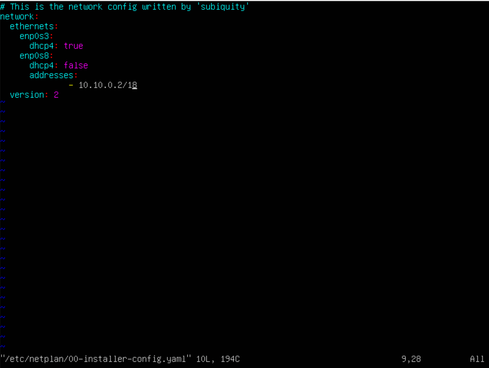
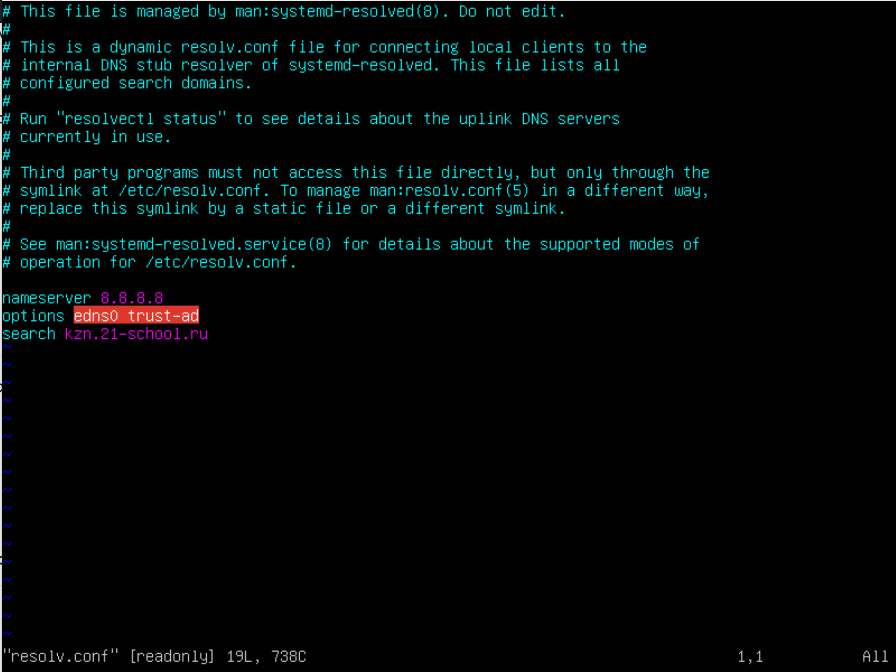
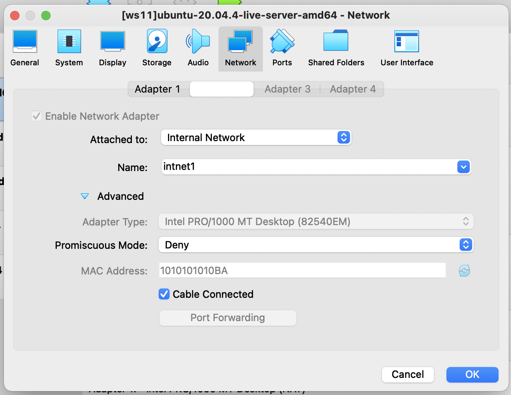

## part1
### 1.1 Сети и маски

*1) Адрес сети 192.167.38.54/13*

*2) Перевод маски 255.255.255.0 в префиксную и двоичную запись, /15 в обычную и двоичную, 11111111.11111111.11111111.11110000 в обычную и префиксную*

**255.255.255.0 -> /24 -> 11111111.11111111.11111111.00000000**

**/15 -> 255.254.0.0 -> 11111111.11111110.00000000.00000000**

**11111111.11111111.11111111.11110000 -> /28 -> 255.255.255.240**

*3) Минимальный и максимальный хост в сети 12.167.38.4 при масках: /8, 11111111.11111111.00000000.00000000, 255.255.254.0 и /4*

### 1.2. localhost
*Определить и записать в отчёт, можно ли обратиться к приложению, работающему на localhost, со следующими IP: 194.34.23.100, 127.0.0.2, 127.1.0.1, 128.0.0.1*

### 1.3. Диапазоны и сегменты сетей

*1) какие из перечисленных IP можно использовать в качестве публичного, а какие только в качестве частных: 10.0.0.45, 134.43.0.2, 192.168.4.2, 172.20.250.4, 172.0.2.1, 192.172.0.1, 172.68.0.2, 172.16.255.255, 10.10.10.10, 192.169.168.1*

	Зарезервированные IP адреса IPv4, которые не маршрутизируются в интернет, а предназначены для построения локальных сетей и VPN сетей:   
	10.0.0.0 — 10.255.255.255 (маска подсети для бесклассовой (CIDR) адресации: 255.0.0.0 или /8).  
	172.16.0.0 — 172.31.255.255 (маска подсети: 255.240.0.0 или /12)   
	192.168.0.0 — 192.168.255.255 (маска подсети: 255.255.0.0 или /16)

**10.0.0.45 - частный.  
134.43.0.2 - публичный.   
192.168.4.2 - частный.   
172.20.250.4 - частный.  
172.0.2.1 - публичный.  
192.172.0.1 - публичный.  
172.68.0.2 - публичный.  
172.16.255.255 - частный.  
10.10.10.10 - частный.  
192.169.168.1 - публичный.**

*2) какие из перечисленных IP адресов шлюза возможны у сети 10.10.0.0/18: 10.0.0.1, 10.10.0.2, 10.10.10.10, 10.10.100.1, 10.10.1.255*

**10.0.0.1 - не возможен.  
10.10.0.2 - возможен.  
10.10.10.10 - возможен.  
10.10.100.1 - не возможен.   
10.10.1.255 - не возможен.**
## part2
*С помощью команды ip a посмотреть существующие сетевые интерфейсы*  
ws1:    

ws2:    

*Описать сетевой интерфейс, соответствующий внутренней сети, на обеих машинах и задать следующие адреса и маски: ws1 - 192.168.100.10, маска /16, ws2 - 172.24.116.8, маска /12*

- Сетевой интерфейс для внутренней сети - enp0s8.

ws1:    

ws2:    

*Выполнить команду netplan apply для перезапуска сервиса сети*

ws1:     

ws2:     

### 2.1. Добавление статического маршрута вручную

*Добавить статический маршрут от одной машины до другой и обратно при помощи команды вида ip r add*

ws1:

ws2:

pings:

### 2.2. Добавление статического маршрута с сохранением

Добавить статический маршрут от одной машины до другой с помощью файла etc/netplan/00-installer-config.yaml   
ws1:    

ws2:     

pings:    

## part3
### 3.1. Скорость соединения
8 Мегабит/с == 8 / 1 == 1 МегаБайт/с   
100 МегаБайт/с == 100 * 8 * 1024 == 819200 Килобит/с    
1 Гигабит/с == 1* 1024 == 1024 Мегабит/с

### 3.2. Утилита iperf3
На одной машине мы пишем  
**$ iperf -s**   
тем самым делая её серверной, а на другой    
**$ iperf -c 192.168.100.10**   
тем самым подключаяюсь к первой машине

## part4
### 4.1. Утилита iptables
ws1:

ws2:

**Запустить файлы на обеих машинах командами chmod +x /etc/firewall.sh и /etc/firewall.sh**

**chmod:**   
ws1:    

ws2:    

**sh:**     
ws1:

ws2:

### 4.2. Утилита nmap
**Командой ping найти машину, которая не "пингуется", после чего утилитой nmap показать, что хост машины запущен**

## part5
### 5.1. Настройка адресов машин

r1:    

r2:    

ws11:    

ws21:   

ws22:    

**$ ip -4 a:**   
r1:

r2:

ws11:

ws21:

ws22:

**pings:**  
r1 & ws11:

ws22 & ws21:

### 5.2. Включение переадресации IP-адресов.
Выключаем переадресацию IP  
r1:

r2:

В конфиге тоже меняем, чтобы она была отключена на постоянной основе

r1:

r2:

### 5.3. Установка маршрута по-умолчанию
Настроить маршрут по-умолчанию (шлюз) для рабочих станций. Для этого добавить gateway4 [ip роутера] в файле конфигураций

ws11:    

ws21:    

ws22:    

**$ ip r** 

ws11:

ws21:

ws22:

Пропинговать с ws11 роутер r2 и показать на r2, что пинг доходит. Для этого использовать команду:

### 5.4. Добавление статических маршрутов

Добавить в роутеры r1 и r2 статические маршруты в файле конфигураций. 

r1:    

r2:    

**$ ip r**   
r1:

r2:

Запустить команды на ws11:
ip r list 10.10.0.0/[маска сети] и ip r list 0.0.0.0/0

Для 0.0.0.0 выбран другой маршрут, потому что он более точный.

### 5.5. Построение списка маршрутизаторов

Утилита traceroute выводит каждый узел, через который проходит пакет. 

Пакет поступает на роутер r1 и отправляется по адресу 10.100.0.12 по сети 10.100.0.0 и оттуда уже пакет доставляется по конечному адресу через 10.20.0.0 сеть

### Part 6. Динамическая настройка IP с помощью DHCP

**$ sudo apt install isc-dhcp-server**

Настраиваем DHCP в конфиге (/etc/dhcp/dhcpd.conf)

r1:   
    
также прописываем dns сервер в /etc/resolv.conf

перезагружаем DHCP службу  
 
**$ systemctl restart isc-dhcp-server**   

Машину ws21 перезагрузить при помощи reboot и через ip a показать, что она получила адрес. Также пропинговать ws22 с ws21.   

ip a:

ping:

Указать MAC адрес у ws11, для этого в etc/netplan/00-installer-config.yaml надо добавить строки: macaddress: 10:10:10:10:10:BA, dhcp4: true

ws11:     

Для r1 настроить аналогично r2, но сделать выдачу адресов с жесткой привязкой к MAC-адресу (ws11). Провести аналогичные тесты

Запросить с ws21 обновление ip адреса

**$ dhclient -r** чтобы освободить адрес  
**$ dhclient** чтобы получить новый

###Part 7. NAT

**$ sudo apt install apache2**     

ws22:    

r1:    

r2 iptables:    

ping:    

r2 iptables:       

pings:      

r2 iptables:      

telnet test:   

